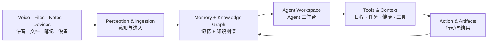

# KnowMe Knowledge · 灵犀知识

### Agent-First · Local-First Personal Knowledge OS
### Agent First · Local First 的个人 AI 知识操作系统

**把 AI，变成你的能力。**  
**Turn AI into your capability.**

KnowMe Knowledge（灵犀知识）探索一种新的个人 AI 工作方式：  
让 **语音、记忆、知识图谱、Agent、日程、任务、健康上下文与多端协作** 进入同一个持续生长的个人智能系统。

**Current mobile focus: Huawei Mate60 / Android · 当前移动端重点：华为 Mate60 / Android**

[官网 / Official Site](https://zhouzengrui369-commits.github.io/knowme-knowledge/) · [关于灵犀 / About](https://zhouzengrui369-commits.github.io/knowme-knowledge/about.html) · [FAQ](https://zhouzengrui369-commits.github.io/knowme-knowledge/faq.html) · [公开进展 / Updates](https://zhouzengrui369-commits.github.io/knowme-knowledge/updates.html) · [公开关注指标 / Signals](https://zhouzengrui369-commits.github.io/knowme-knowledge/signals.html)

---

## Why KnowMe / 为什么做灵犀

今天的大多数 AI 产品仍然从“聊天框”开始。

KnowMe 想从另一个起点出发：

> **不是给应用加上 AI，而是从 Agent 出发。**

Agent 先理解你要完成什么，再组织知识、记忆、工具与行动；  
系统不仅回答问题，还要帮助你把结果留下来，让每一次实践成为下一次行动的起点。

这也是灵犀系列的长期价值方向：

**超级个人 → 超级团队 → 超级组织**

- **超级个人 / Super Individual** — 让学习、思考、记忆和行动彼此连接。
- **超级团队 / Super Team** — 让个人经验逐步沉淀为可共享、可调用的团队能力。
- **超级组织 / Super Organization** — 让知识、流程与智能体进入真实业务协作。

> 团队与组织能力是长期方向，不代表对应产品已经发布。

---

## What KnowMe is building / 正在构建什么

KnowMe Knowledge 的核心不是“更多功能”，而是一个持续生长的个人 AI 能力闭环：

### Product principles / 产品原则

| Principle | What it means |
|---|---|
| **Agent First** | 从目标和上下文开始，而不是从按钮和菜单开始 |
| **Local First** | 优先让个人数据与关键能力留在用户可控制的本地环境 |
| **Human Always** | AI 增强人的能力，关键判断、确认与授权仍属于人 |
| **Memory that grows** | 让记录、经验和结果进入长期记忆与知识网络 |
| **Evidence & traceability** | 来源、上下文和重要行动尽可能可追溯、可检查 |
| **Replaceable intelligence** | 模型与 Agent 框架可以持续升级，不把产品绑定在单一模型上 |

---

## Six showcase scenes / 六个重点场景

灵犀网站当前重点展示六类体验。它们共同表达 KnowMe 的产品方向：

### 01 · Neural Perception / 神经感知
让语音、输入和环境信号从“入口”变成持续感知的一部分。  
目标是降低记录成本，让知识捕获更自然。

### 02 · Intelligent Agent Dialogue / 智能对话
不只是问答，而是在知识上下文中与 Agent 协作：  
理解目标、读取资料、解释依据、推进下一步。

### 03 · 2D Knowledge Graph / 2D 知识图谱
用关系图谱连接主题、记录、来源与认知维度，  
从“找到文件”走向“理解知识之间的关系”。

### 04 · 3D Cognitive Galaxy / 3D 认知星海
把持续生长的知识与认知网络转化为更具空间感的探索体验。  
这是 KnowMe 对“可视化认知系统”的探索方向。

### 05 · Calendar & Tasks / 日程与任务
让知识不止被保存，还能够进入计划、日程、待办与真实行动。  
从“我知道什么”走向“我下一步要做什么”。

### 06 · Health Context / 健康上下文
探索把健康资料、生活节律、行动计划与 Agent 放入同一上下文。  
健康相关能力坚持来源可追溯、用户确认与非诊断边界。

> **展示边界**：网站和仓库中的部分画面使用合成演示资料；  
> 页面演示、代码存在、工程候选、Product Experience PASS、Human Owner Acceptance 与正式 Release 是不同状态，不能互相替代。

---

## Current development focus / 当前研发重点

当前项目正在围绕以下方向持续推进：

- **Huawei Mate60 / Android 原生客户端**
- **离线中文语音采集与转写**
- **个人长期记忆与知识增长**
- **Agent-native 工作方式**
- **2D / 3D 知识与认知图谱**
- **日程、待办与项目行动闭环**
- **账户 / 工作区与多设备协作**
- **本地优先的数据边界**
- **可替换模型与 Agent Harness**
- **健康上下文与插件化能力扩展**

项目采用分阶段、可验证的工程治理方式推进。  
**公开仓库 ≠ 已正式发布产品。** 当前状态请以仓库中的 Goal / Milestone、PR、exact SHA 和证据为准。

---

## Why this project may matter / 为什么值得关注

KnowMe 关注的是一个比“AI 助手”更大的问题：

**当 AI 可以理解上下文、长期记忆并执行工具后，个人软件应该长什么样？**

我们希望探索：

1. AI 能否从“临时回答”变成长期协作者；
2. 个人知识库能否从“存储系统”变成行动系统；
3. Agent 能否真正连接记忆、工具、日程、健康和现实任务；
4. Local First 与先进模型能力能否同时成立；
5. 一个人积累的经验，如何逐步成为可复用、可增强的能力。

如果你也在关注 **Personal AI、AI Agent、Personal Knowledge Management、Knowledge Graph、Long-term Memory、RAG、Offline ASR、Local-first AI、Agentic Workflow、Android AI、Huawei Mate60、Human-AI Collaboration**，欢迎关注这个项目。

---

## Follow the journey / 关注项目进展

如果你认同 **Agent First + Local First + Human Always** 这个方向：

- ⭐ **Star** — 让更多对 Personal AI / Agent 感兴趣的人看到这个项目
- 👀 **Watch** — 跟踪新的产品演示、里程碑与工程进展
- 💬 **[公开交流 Issue #43](https://github.com/zhouzengrui369-commits/knowme-knowledge/issues/43)** — 分享真实使用场景、问题或合作方向
- 🔗 **Share** — 把项目分享给正在研究 AI Agent、知识管理或个人 AI 的朋友

> 我们更欢迎真实场景和具体问题，而不是为了功能数量而增加功能。

---

## About NJX / 关于 NJX

我是 **NJX**，灵犀 KnowMe 系列的创造者与实践者。

我关心的不只是 AI 能做什么，  
而是 **AI 能让人做到什么。**

我希望把先进的 Agent 技术放进真实的工作与生活场景里，  
帮助更多人提升效率、增强能力，并逐步走向更有创造力的个人、更高效的团队和更有学习能力的组织。

**Agent First. Human Always.**

### Contact / 联系方式

- **Email:** [zhouzengrui369@gmail.com](mailto:zhouzengrui369@gmail.com)
- **WeChat:** `zhouzengrui`
- **GitHub:** [@zhouzengrui369-commits](https://github.com/zhouzengrui369-commits)

---

## English summary

**KnowMe Knowledge** is an **Agent-First, Local-First personal AI knowledge operating system** exploring how voice capture, long-term memory, knowledge graphs, agent workflows, calendar/tasks, health context and multi-device collaboration can become one continuously growing personal intelligence workspace.

The project currently focuses on **Huawei Mate60 / Android**, offline-first capture, personal memory, 2D/3D knowledge visualization, agent-native workflows and replaceable model / harness architecture.

The long-term vision is simple:

> **Turn AI into your capability — for super individuals, super teams and super organizations.**

---

## Discovery keywords

`agent-first` · `local-first` · `personal-ai` · `ai-agent` · `knowledge-management` · `personal-knowledge-management` · `knowledge-graph` · `long-term-memory` · `rag` · `offline-asr` · `android` · `huawei-mate60` · `agentic-workflow` · `multi-device` · `calendar` · `task-management` · `health-agent` · `human-ai-collaboration`

---

Public visibility is for project discovery and collaboration. No license is currently declared; public visibility does not by itself grant reuse rights. Product/release status must be verified from the repository's current governance records and exact candidate evidence.
