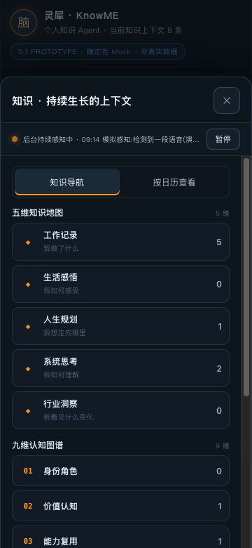
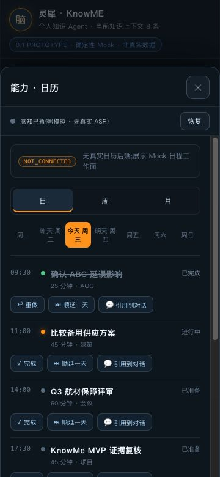

# Owner Decision Brief

Review Mode: FOCUSED_RETEST
Candidate: KnowME Knowledge / PR #12 / GOAL-KK-01-AGENT-NATIVE-MATE60-PROTOTYPE
Commit: 0e859d93960e630965a5b71a3ff4c07e631d8570
Artifact SHA-256 / Deployment ID: 9db96a26a6821c134d2ca543ebd5016f0654ac60bc6eb48976ceb4e3cd6a2a02

**Contract Product Experience Verdict: FAIL** — 三项 CLOSED，一项 PARTIALLY_FIXED；未满足四项全部关闭的正式复验条件。

Product Experience Verdict: NOT_READY（本轮 Contract R2 原型体验 lane；真实产品 Runtime 未评）
Release Evidence Verdict: BLOCKED_INCOMPLETE_EVIDENCE（本轮是原型体验证据，不是生产 release package）
Prototype Concept Verdict: PROTOTYPE_PARTIAL
Prototype-to-Runtime Parity: PARITY_NOT_APPLICABLE

本轮核心承诺：新增知识可正确再次调用；用户在知识、工作面、日历、待办中始终看到感知状态、控制及模拟边界；修正与确认分离；单击返回 Agent。
核心承诺是否成立：大部分成立，但运行态感知条把末尾“模拟 · 无真实 ASR”截断，未完整满足 AO-09 与 referral 的持续可见披露条件。

上一轮 P0 状态：上一探索性报告未确认 P0；本轮不继承其全产品无 P0 声明。
本轮新 P0：NONE_OBSERVED（仅限已操作的合成原型旅程）。

最重要的正面信号：
1. 读书、健身两个不同主题的精确标题与自然问法均返回自身内容，工作面无无关航材结论或虚构冲突。
2. 保存修正保持候选，知识数不变；显式确认才 +1；拒绝不增长；详情不再同时显示待确认和 CONFIRMED。
3. 从知识导航或 Agent 下一步进入工作面，均可一次点击回到原对话；日历和待办快速操作、日期联动可用。

开发线程必须完成：KK-PX-R5-02 的运行态持续披露可见性。保持已修好的状态显示、暂停/恢复和正文布局。
下一轮只需定向复验：五个 surface 的 ON/PAUSED 视觉披露与控制，附必要的返回/滚动回归。
Owner 当前建议：[x] 修复后定向复验。没有 Owner Acceptance、merge、release 或 Goal/Milestone 关闭授权。

## 1. Role, scope and authority

```text
ACTOR_ROLE=INDEPENDENT_PRODUCT_EXPERIENCE_REVIEWER
ACTOR_CONTEXT_ID=PX-KK-GOAL01-PX1-FOCUSED-0E859D9-6A73C1
INPUT_STATE=PRODUCT_REVIEW_ELIGIBLE
OUTPUT_STATE=PRODUCT_EXPERIENCE_FAIL
REVIEW_MODE=FOCUSED_RETEST
DID_NOT_AUTHOR_CANDIDATE=YES
DID_NOT_TECHNICALLY_GATE_CANDIDATE=YES
DID_NOT_ADMIT_CANDIDATE=YES
DID_NOT_PERFORM_PRODUCT_GOVERNANCE=YES
CODE_BLIND_FOR_VERDICT=YES
ISOLATION_STATUS=PRIMED_COGNITIVE_WALKTHROUGH
```

本上下文为新的独立 Reviewer。按用户明确要求，在操作前读取已知问题、基线和准入，因此不声称 BLIND_TEST；这不改变未 author/技术验收/准入同一候选的角色独立性。没有检查产品源码或测试、没有重建或修复产品。仅下载哈希核验后的 HTML transport，真实浏览器点击、键盘输入、滚动、截图，并只读采集渲染 DOM 的截断尺寸。没有使用 Engineering/Parent PM 截图或115/115作 verdict。

Fresh GitHub authority:

- AGENTS.md 与治理锁：候选 commit 与 R2 governance commit 中的已提交版本；main 仍只有初始化内容，未将 main 中缺失文件解释成可跳过治理。
- Governance Core / State Machine: chatgpt-parent-pm @118594ff0b853732a2da22270d9499573ff2201e；仅读取角色边界，不执行治理转换。
- Product Baseline: PRODUCT-BASELINE-KNOWME-KNOWLEDGE-20260916-v2，governance/PRODUCT_BASELINE.md @978ed0608bda8e278c348ad2987f6a25fa3c3c2f。
- Contract R2: governance/milestones/GOAL-KK-01-AGENT-NATIVE-MATE60-PROTOTYPE/CONTRACT-R2.md @978ed0608bda8e278c348ad2987f6a25fa3c3c2f；tree db0be0e4ac22b9780cf5cf3c80998d3cfd15731d；blob 05bc2ca7cce5e8645301994b348f702f2286d3f3。
- Approved CR: CR-KK-01-OWNER-DIRECTED-R2-R3，same governance commit。
- [Candidate Admission](https://github.com/zhouzengrui369-commits/knowme-knowledge/issues/3#issuecomment-5699746187)。
- [Product Review Eligibility + Focused Referral](https://github.com/zhouzengrui369-commits/knowme-knowledge/issues/3#issuecomment-5699938604)。
- Prior report + Parent handoff: PR #11 @e095af1fa6bfc988360c252bd16e6dbdef2262ee，2026-09-16-knowme-knowledge-r5-product-experience-review.md 与 -parent-handoff.md。其探索性结论不升级为独立 Gate，也不传递 PASS。
- Reviewer Skill: product-experience-reviewer-skill @4253deb55a04de20fca6ac50a47b42a6d4489c04 / tree eaa62967737b17cc8ad07e46e297e0a52b2c3092。Exact skill 已下载并运行 validator，见证据。

PROJECT_STATUS 与候选中的 CONTRACT.md/旧 baseline 是历史快照；本次使用明确后继 Contract-R2.md、v2及 exact referral，不把旧状态混用为当前合同。未修改任何治理文档。

## 2. Candidate identity and review environment

```text
REPOSITORY=zhouzengrui369-commits/knowme-knowledge
BRANCH=engineering/goal-kk-01-px-findings-correction-r1
CANDIDATE_PR=12
CANDIDATE_SHA=0e859d93960e630965a5b71a3ff4c07e631d8570
CANDIDATE_TREE=f93f4cfa9c539c22873e228df2738a21cb2bd1b9
CANDIDATE_PARENT=40063afd16a36674e8660f6b4a05315d51f4e546
PR_STATE=OPEN_DRAFT_UNMERGED
PR_HEAD_MATCH=YES
BRANCH_HEAD_MATCH=YES
REVIEW_ARTIFACT_COMMIT=672b971ca4df3dcecbc3e67e4928c10122aad344
REVIEW_ARTIFACT_BRANCH=evidence/goal-kk-01-non-candidate-r2
REVIEW_ARTIFACT_PATH=reports/prototype/knowme-knowledge-01-agent-native-mate60/deliverable/KnowME-Knowledge-01-Prototype.html
REVIEW_ARTIFACT_BLOB=199df60b62cde53fe7be03c10b44fc412618a99c
REVIEW_ARTIFACT_SHA256=9db96a26a6821c134d2ca543ebd5016f0654ac60bc6eb48976ceb4e3cd6a2a02
```

Artifact 从 Git blob API base64 解码，202369 bytes；git hash-object 与 shasum -a256 双重匹配。Evidence commit 的 tree 也确认该路径指向此 blob。Source candidate binding 来自 fresh admission/referral；未通过重建独立证明构建来源。

- Working Tree Status: 未 checkout 或修改产品候选；本地审核目录起初不是 git repo。报告用新的 review branch，禁止触及候选 branch。
- Entry: http://127.0.0.1:18764/KnowME-Knowledge-01-Prototype.html；仅 loopback 静态传输 exact HTML。file://未另测。
- Build Command / Timestamp: 未重建，未独立核验 build timestamp；本轮以已固定 transport bytes 复现。
- OS / Architecture: macOS 26.2 (25C56) / arm64。
- Browser: Codex in-app browser，独立新 tab；360×780 CSS viewport。不是 Mate60 真机测量；未采集内核版本。
- Backend / Model / Provider: deterministic mock，未接真实 provider/ASR/日历待办后端。
- Dataset: 初始6条fixture；本轮增加两条合成知识、拒绝一条合成草稿，最终8条。未输入 Owner 私密数据。
- Network: 本地 loopback；未进行断网或全量网络请求审计。
- Configuration: 无账号/凭据注入，prototype-local state；不要求跨刷新持久化。
- Time: 2026-09-16 深夜至 2026-09-17 00:04+ Asia/Shanghai；按要求保留2026-09-16报告文件名。原型内“今天2026-09-16”属于固定fixture，不是系统时间证据。操作序列见 interaction-log.json。

## 3. Issue focused retest

### KK-PX-R5-01 — CLOSED

```text
ISSUE_ID=KK-PX-R5-01
PRIOR_STATUS=OPEN
ACCEPTANCE_REPLAYED=YES
CURRENT_STATUS=CLOSED
REGRESSION=NONE_OBSERVED_IN_REPLAY
```

A 输入：读书笔记复核：先核对原文，再更新知识，整理一页复核摘要。修正标题为“读书笔记复核”后显式确认。
B 输入：健身计划：本周完成三次力量训练，并记录卧推训练重量。修正标题为“健身计划”后显式确认。

两条均完整执行 Capture → Candidate → Confirm → exact-title query → natural-language query → detail → work surface。自然问法分别为“我的读书笔记复核要做什么？”和“我的健身计划这周安排了哪些训练？”。

ACTUAL_RESULT: 回答与引用标题、详情摘要/正文、工作面内容和来源均指向所选条目自身。工作面显示没有可模拟确定性结论、关联0条、证据1条（自身捕获）、冲突0项；没有 AOG/ABC/30分钟/4小时套用在这两条回答或工作面上。首屏静态fixture背景仍含AOG，不将此视为回答跨主题污染。

```text
TOPIC_A_CONTENT_MATCH=YES
TOPIC_B_CONTENT_MATCH=YES
CROSS_TOPIC_LEAKAGE=NO_OBSERVED
UNRELATED_AOG_ABC_TEMPLATE=NO
HONEST_NO_CONCLUSION_WHEN_NEEDED=YES
```

NEW_EVIDENCE: 03–07、10–13、18–19 JPEG；操作序列A/B对应label。
用户影响：新增知识被再次调用时，其内容与来源能够对得上；无结论时表达边界。未验证任意开放自然语言理解，不把本结果升级为真实RAG/模型能力。

### KK-PX-R5-02 — PARTIALLY_FIXED

```text
ISSUE_ID=KK-PX-R5-02
PRIOR_STATUS=OPEN
ACCEPTANCE_REPLAYED=YES
CURRENT_STATUS=PARTIALLY_FIXED
REGRESSION=RESIDUAL_ON_STATE_DISCLOSURE_CLIPPING
```

在 Knowledge、Knowledge Detail、Work Surface、Calendar、Todo 五个surface逐一亲自暂停→观察PAUSED→恢复→观察ON，均可操作并同步回主界面。状态和按钮已摆到浮层顶部，不再整体被工作面遮住；正文、返回和快捷操作没有被感知条遮挡，没有遇到阻断水平滚动。

但 ON 感知条是一行长文本：状态 + 模拟片段 + 末尾“(模拟 · 无真实 ASR)”。360×780截图中末尾披露落入省略号。PAUSED短文案可完整看见“模拟 · 无真实 ASR”。不能用 AX/DOM 字符串中存在“无真实 ASR”来证明视觉可见。

| Surface | ON状态/控制 | PAUSED状态/披露/控制 | ON末尾无真实ASR视觉披露 | Evidence |
|---|---|---|---|---|
| Knowledge | 可见，亲自暂停/恢复 | 可见、可恢复 | 截断 | 16、17、39 |
| Knowledge Detail | 可见，亲自暂停/恢复 | 可见、可恢复 | 截断 | 05、06、12、18 |
| Work Surface | 可见，亲自暂停/恢复 | 可见、可恢复 | 截断 | 07、08、13、19 |
| Calendar | 可见，亲自暂停/恢复 | 可见、可恢复 | 截断 | 26、27、28 |
| Todo | 可见，亲自暂停/恢复 | 可见、可恢复 | 截断 | 33、34、35 |

只读渲染测量：Knowledge运行态文本 clientWidth=254，scrollWidth=404，overflow=hidden，text-overflow=ellipsis，white-space=nowrap；截图39直接证明可见文字止于省略号。此为截图的辅助定位，不是源码审查。

```text
SENSING_VISIBLE_ACROSS_WORK_SURFACES=YES
SENSING_CONTROL_REACHABLE=YES
ON_PAUSED_SYNC=YES
HONEST_SIMULATION_DISCLOSURE=PARTIAL_ON_CLIPPED_PAUSED_VISIBLE
```

NEW_EVIDENCE: 05–08、12–13、16–19、26–28、33–35、39；sensing-clipping.json；interaction-log.json。

#### Residual issue contract — KK-PX-R5-02

Severity: P1 retained / core acceptance not closed（严重程度已缩小为持续披露缺失；不宣称真实监听或P0隐私事故）。
Journey: A / D / E。
User Promise Violated: AO-09 与本次 referral 明确要求模拟/无真实ASR持续可见。
Observed Behavior: 运行态能看见“后台持续感知中”和暂停，但完整模拟边界被省略；暂停后才露出无真实ASR。
Expected Behavior: ON、PAUSED都无需退出当前工作或悬停即可看到模拟/无真实ASR。
Evidence: 07-A-work-on.jpg、16-knowledge-on.jpg、39-sensing-clipping.jpg 与 sizing JSON，PAUSED对照06/27/34。
Likely User Impact: 用户在持续工作和模拟感知运行时无法直接读到完整能力边界。全局PROTOTYPE字样与片段中的“模拟”减轻混淆，但不能替代合同指定的无真实ASR可见披露。
Current Scope: IN_CURRENT_RELEASE_SCOPE。
Required Behavior: 为能力边界保留稳定可见区域，长片段不得挤掉它；保持状态与控制可达。
Acceptance Criteria: exact successor artifact / 360×780；五surface × ON/PAUSED；截图均能完整读出模拟/无真实ASR；亲自暂停恢复且无关键内容重叠或阻断横向溢出。
Focused Retest Steps: 冷开→逐个surface→ON截图→暂停→PAUSED截图→恢复→检查滚动/返回；用当前条目继续工作验证上下文。
Required Retest Evidence: 新exact SHA/tree/hash、五surface两态截图与真实交互序列。
Regression Risk: 长文案、浮层头部高度、正文滚动空间、返回/快捷动作。

### KK-PX-R5-03 — CLOSED

```text
ISSUE_ID=KK-PX-R5-03
PRIOR_STATUS=OPEN
ACCEPTANCE_REPLAYED=YES
CURRENT_STATUS=CLOSED
REGRESSION=NONE_OBSERVED_IN_REPLAY
```

ACTUAL_RESULT: 初始6条。A候选修正页面明确说明“保存修正仅更新候选内容并返回候选卡，不会直接入库”；保存后仍CANDIDATE/待确认，6条不变，保留确认入库按钮。显式确认后7条；详情标签“捕获 已确认”，状态CONFIRMED，无待确认。B重复保存/确认路径7→7→8。另起“拒绝样例”候选，拒绝后消息说明未进入上下文，关闭捕获后仍8条。

```text
SAVE_CORRECTION_DIRECT_INGEST=NO
SAVE_CORRECTION_STILL_CANDIDATE=YES
CONFIRM_EXPLICIT=YES
CONFIRMED_AND_PENDING_CONFLICT=NO
REJECT_GROWS_KNOWLEDGE=NO
```

NEW_EVIDENCE: 01、02、05、12、14、15；interaction-log中的A/B saved/confirmed与reject labels。
用户影响：用户可分辨修改草稿和最终确认；计数与状态一致。

### KK-PX-R5-04 — CLOSED

```text
ISSUE_ID=KK-PX-R5-04
PRIOR_STATUS=OPEN
ACCEPTANCE_REPLAYED=YES
CURRENT_STATUS=CLOSED
REGRESSION=NONE_OBSERVED_IN_REPLAY
```

ACTUAL_RESULT: Path B先从A自然回答“打开…工作面”进入详情→打开上下文工作面→一次点击“← 返回 Agent 对话”，立即见原问答。Path A后从知识导航→工作记录→读书笔记→详情→工作面→一次点击同按钮，所有浮层消失，读书/健身及拒绝消息保留。未多次点关闭来制造返回成功。

```text
NAV_PATH_ONE_CLICK_RETURN=YES
AGENT_PATH_ONE_CLICK_RETURN=YES
BUTTON_LABEL_MATCHES_TARGET=YES
CONVERSATION_CONTEXT_PRESERVED=YES
```

NEW_EVIDENCE: 05、07、09（Path B）；18、19、20（Path A）；interaction-log中两条路径的连续操作观察。
用户影响：按钮目标与实际落点一致，不再需要逐层退出。

## 4. Regression sampling

| Sample | Actual result | Evidence |
|---|---|---|
| Agent-first首屏 | 6条上下文、已知/未知、主对话、捕获和能力入口、Mock标示；首次行动可辨识 | 00 |
| 五维地图 | 五个冻结维度、工作记录展开可见两条新增知识；生活感悟0显示诚实空态 | interaction-log / 16 |
| 九维图谱 | 九个冻结维度可见；身份角色0诚实空态；动态与情景3包含新增两条 | 21、22 / log |
| 知识日周月 | 日视图今天6条含新增两条；周视图同日6条；月视图圆点与日期入口 | 23–25 |
| Calendar日周月 | 可切换；顺延后明天在日/周均为10:00在11:00前；月有相关日期圆点 | 28、31、32 |
| 日程完成/顺延/引用 | 比较备用供应方案11:00顺延到9月17日；完成后已完成；引用携正确日期和关联知识回Agent | 28–30 / log |
| Todo完成/顺延/引用 | 补齐备用供应商成本证据勾选完成、顺延至9月17日、引用回对话 | 35、37 / log |
| Todo→Calendar day | 从已顺延Todo日期按钮到9月17日“明天”日视图，含完成的对应Todo | 36 |
| NOT_CONNECTED | 日历/待办均说明无真实后端 | 26、33–34 |
| PROTOTYPE_ONLY | 捕获语音/文件/网页说明未真实接通 | 01、14 / log |
| PLANNED | 技能明确后续Goal，本轮未实现 | 38 |
| 360×780 | 核心点击/输入/滚动可达；已发现ON披露截断；不据AX可见替代像素可见 | 原始JPEG均360×780 |

### P3 reference-date repetition — still observed

日程引用卡显示2026-09-17 11:00，Agent回复再次原样重复；待办卡显示2026-09-17，回复再次重复。日期没有重复成同一字段内两串，但按本次明确要求的“quote card + reply 不机械重复两遍”，仍记录P3。Evidence: 30-event-quote-answer、37-todo-quote及log。非正式阻断项，不混入P1残留原因。

### Not reviewed / scope fairness

IN_CURRENT_RELEASE_SCOPE: 本次四项复验和上述回归抽样。未重跑Engineering 115条断言；未穷尽九维每维、全部日期、任意自然问法、所有fixture路径；未做Owner Demo精确并排视觉复核；不声明完整UI lineage新PASS。

OUT_OF_CURRENT_RELEASE_SCOPE: 真实HarmonyOS/Mate60设备、模型/Harness/provider、真实ASR/声纹/后台麦克风、真实导入/RAG/后端/Owner数据/长期持久化/生产发布。未实现这些不构成本轮FAIL原因。

Runtime用户旅程: 未提供真实产品Runtime，未评分。Only-in-prototype: 本轮全部对话、捕获、导航、日历待办、感知行为。Divergent: 无Runtime可比较。Not-yet-productized: provider、持久化、ASR/RAG等合同外能力。

本轮没有真正隔离Stage A；已知问题提示下的首次观察为：首屏是以对话和知识上下文为中心的移动原型，入口明确，Mock边界有提示。不会把这一观察重命名为盲测冻结结果。问题结论依据本轮后续真实操作。

## 5. Inheritance matrix and scoring

| Prior issue | Current status | New evidence | Closed | Regression |
|---|---|---|---|---|
| KK-PX-R5-01 P1 | CLOSED | 03–07、10–13 | YES | 无已见跨主题污染 |
| KK-PX-R5-02 P1 | PARTIALLY_FIXED | 两态五surface、39及测量 | NO | ON披露仍不可完整读到 |
| KK-PX-R5-03 P2 | CLOSED | 01、02、05、12、14、15 | YES | 未见 |
| KK-PX-R5-04 P2 | CLOSED | 05/07/09、18–20 | YES | 未见 |
| P3 顺延排序 | CLOSED_IN_SAMPLE | 28、31 | 仅该样本 | 10:00→11:00 |
| P3 日期重复 | OPEN | 30、37 | NO | 非阻断 |

Prototype-only评分（不归一为Runtime分数）：

| Dimension | Score | Applicable | Evidence | Reason |
|---|---|---|---|---|
| 新知识内容/来源一致性 | 4/5 | IN_CURRENT_RELEASE_SCOPE | 03–13 | 两主题一致，诚实无结论；仅有限问法 |
| 候选控制与确认 | 4/5 | IN_CURRENT_RELEASE_SCOPE | 01/02/05/14/15 | 分离保存与确认，状态计数一致 |
| 返回与连续性 | 4/5 | IN_CURRENT_RELEASE_SCOPE | 09/20 | 两路径一次返回保留上下文 |
| 持续感知与边界表达 | 3/5 | IN_CURRENT_RELEASE_SCOPE | 06–08/16/17/27/34/39 | 状态控制修好，ON完整披露仍缺失 |
| 日历待办协作抽样 | 4/5 | IN_CURRENT_RELEASE_SCOPE | 28–37 | 快捷动作/日期联动成立，日期重复P3 |
| 真实模型/ASR/持久化 | N/A | OUT_OF_CURRENT_RELEASE_SCOPE | Contract R2 | 不纳入原型得分 |

## 6. Four verdicts / Human Owner Gate / Parent handoff

```text
CONTRACT_PRODUCT_EXPERIENCE_VERDICT=FAIL
PRODUCT_EXPERIENCE_VERDICT=NOT_READY
RELEASE_EVIDENCE_VERDICT=BLOCKED_INCOMPLETE_EVIDENCE
PROTOTYPE_CONCEPT_VERDICT=PROTOTYPE_PARTIAL
PROTOTYPE_TO_RUNTIME_PARITY=PARITY_NOT_APPLICABLE
REAL_RUNTIME_EXPERIENCE=NOT_REVIEWED_OUT_OF_CURRENT_CONTRACT
NEW_P0=NONE_OBSERVED
BLOCKING_RESIDUAL=KK-PX-R5-02
NEW_BLOCKING_REGRESSION=NONE_OBSERVED
HUMAN_OWNER_GATE=NOT_ELIGIBLE_FOR_CLOSURE_ON_THIS_FAIL
HUMAN_OWNER_ACCEPTANCE_CLAIMED=NO
MERGE_RELEASE_CLAIMED=NO
GOAL_MILESTONE_CLOSED=NO
NEXT=PRODUCT_GOVERNANCE_RECONCILE_FAILED_FOCUSED_RETEST
STOPPED=YES
```

本次FAIL针对合同原型视觉披露残留；不把真实Runtime未实现当作原型失败。P0未见不能代替四项关闭，本次不提交通过建议。Parent PM应接收此独立FAIL及已关闭三项，安排独立Engineering按现有AO-09补齐披露；如产生新candidate必须重新绑定准入与复验，不能改写本报告或自动继承PASS。Owner是否曾表达接受由Parent另行处理，本Reviewer不adjudicate。

## 7. Evidence manifest

Evidence directory: [2026-09-16-knowme-knowledge-px1-focused-retest/evidence](2026-09-16-knowme-knowledge-px1-focused-retest/evidence/)

- 原始JPEG截图编号00–39（30同时含引用等待态和完成态）；每张360×780，均本Reviewer生成。
- interaction-log.json：每次操作后的AX观察与动作标签，按序列证明流程；包含动态感知Mock tick，tick不是真实录音。
- sensing-clipping.json：渲染文字尺寸和省略号样式，用于解释截图中的实际截断。
- browser-console.json：本tab可获取的warn/error为空；不是独立全量pageerror监听或网络审计。
- authority-verification.json：审核后fresh PR/branch/commit/tree/parent/hash与OS记录。
- issue3-5699746187.json、issue3-5699938604.json：本轮fresh准入与资格回执快照，只用作授权定位。
- KnowME-Knowledge-01-Prototype.html：未改动的已核验transport复本。
- skill-validation.txt：exact技能与报告验证。
- SHA256SUMS.txt：交付证据校验。

重点视觉证据：





core_sha256=041a475d8cbc3404ed1e6df66c52377aecfcd631721d18a0ec9de59783f2b676

Evidence format note: 浏览器截图API返回原始JPEG字节，交付使用.jpg扩展名；未转换或修改截图像素。技能校验首次发现下载缺少仓库支持文件、报告缺少标准标题与Core hash，补齐exact支持文件及报告字段后重新校验，未更改技能或Core。
