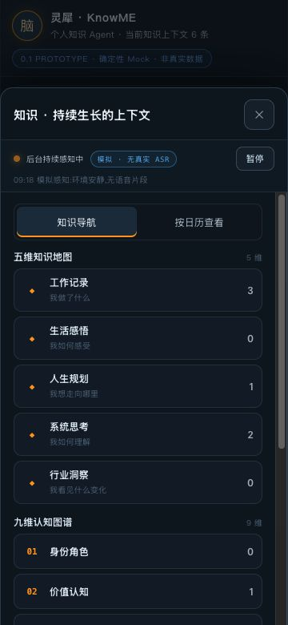
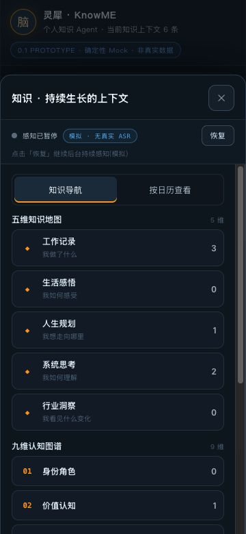

# Owner Decision Brief

Review Mode: FOCUSED_RETEST  
Candidate: KnowME Knowledge / PR #15 / Contract R2 browser prototype  
Commit: f89fe6695ebdbfa69e6b569447247120fab0c360  
Artifact SHA-256 / Deployment ID: fff5fe152c204471263a97d9753a09317dea2d08e4aec585ab25dff5b5eaf539

**Contract Product Experience Verdict: PASS — KK-PX-R5-02 CLOSED，必要回归抽样未发现阻断。**

Product Experience Verdict: EXPERIENCE_READY（仅当前 Contract R2 原型体验范围）  
Release Evidence Verdict: BLOCKED_INCOMPLETE_EVIDENCE（本轮没有生产发布包，生产发布在合同外）  
Prototype Concept Verdict: PROTOTYPE_PROMISING  
Prototype-to-Runtime Parity: PARITY_NOT_APPLICABLE

本轮核心承诺：360×780 下五个工作面在 ON / PAUSED 中持续完整展示“模拟 · 无真实 ASR”，暂停/恢复可达且真实改变状态，正文和上下文继续可用。
核心承诺是否成立：成立，十个必需视觉状态均由本 Reviewer 新截图逐张核对，五次暂停和五次恢复实际点击完成。长动态片段仍可能省略，但能力边界独立完整可读。

上一轮 P0 状态：此前 formal PX 未报告 P0；不据此声明全产品无 P0。
本轮新 P0：NONE_OBSERVED_IN_REVIEWED_SCOPE。

最重要的正面信号：
1. 五个工作面 ON / PAUSED 披露均完整可读，未靠 DOM 字符串、悬停、横向滚动或退出面板证明。
2. 薄荷、陶艺两条新知识的自然提问返回各自内容；修正草稿后仍为候选，显式确认才入库。
3. 两条工作面路径均一次返回 Agent，原问答保留；日历/待办抽样操作及跨面板暂停状态同步成立。

开发线程必须完成：本次授权定向复验范围内无新增必修项。
下一轮只需定向复验：本 exact candidate 无剩余本轮 blocker；任何 successor candidate 不自动继承本 PASS。
Owner 当前建议：[x] 将本原型体验证据提交独立 Human Owner Gate；这不代表生产放行。

`HUMAN_OWNER_GATE_REQUIRED`

## 1. Role, authority and scope

```text
PROTOCOL_VERSION=DELIVERY-LIFECYCLE-1.0
GOAL_ID=GOAL-KK-01-AGENT-NATIVE-MATE60-PROTOTYPE
MILESTONE_ID=MILESTONE-GOAL-KK-01-AGENT-NATIVE-MATE60-PROTOTYPE
ACTOR_ROLE=INDEPENDENT_PRODUCT_EXPERIENCE_REVIEWER
ACTOR_CONTEXT_ID=PX-KK-GOAL01-PX02-FOCUSED-F89FE66-20260917-1625-A91C
INPUT_STATE=PRODUCT_REVIEW_ELIGIBLE
OUTPUT_STATE=PRODUCT_EXPERIENCE_PASS
REVIEW_MODE=FOCUSED_RETEST
ISOLATION_STATUS=PRIMED_COGNITIVE_WALKTHROUGH
CODE_BLIND_FOR_VERDICT=YES
DID_NOT_AUTHOR_CANDIDATE=YES
DID_NOT_TECHNICALLY_GATE_CANDIDATE=YES
DID_NOT_ADMIT_CANDIDATE=YES
DID_NOT_PERFORM_PRODUCT_GOVERNANCE=YES
```

本 fresh Reviewer context 不复用 eligibility-attestation context。依用户要求先读取已知问题、authority 与 prior formal review，所以不声称真正 BLIND_TEST，也不伪造 Stage A 隔离冻结。全程未打开产品 App.jsx、styles.css、browser_assertions.py、tests 或 Engineering diff，未修复或重建候选。Engineering、PG 和 prior Reviewer 截图均不作为本轮新证据。

Fresh GitHub authority:

- AGENTS.md / GOVERNANCE_LOCK.json：候选 committed 版本；锁定 Governance Core 与 State Machine @118594ff0b853732a2da22270d9499573ff2201e，只读角色边界。
- Project adapter/profile、ecosystem policy、PROJECT_STATUS 已读取。旧 status、候选所带 baseline v1 / CONTRACT.md 为历史快照；本轮采用明确 successor pins，不修改历史文档。
- Product Baseline v2: governance/PRODUCT_BASELINE.md @978ed0608bda8e278c348ad2987f6a25fa3c3c2f / blob 8afd987cc07aa1e2a35d3740f2fb1a777cb957f9。
- Contract R2: governance/milestones/GOAL-KK-01-AGENT-NATIVE-MATE60-PROTOTYPE/CONTRACT-R2.md @978ed0608bda8e278c348ad2987f6a25fa3c3c2f / tree db0be0e4ac22b9780cf5cf3c80998d3cfd15731d / blob 05bc2ca7cce5e8645301994b348f702f2286d3f3；批准 CR 为 CR-KK-01-OWNER-DIRECTED-R2-R3。
- [Admission](https://github.com/zhouzengrui369-commits/knowme-knowledge/issues/3#issuecomment-5707326370)。
- [唯一正式 activation authority / exact referral](https://github.com/zhouzengrui369-commits/knowme-knowledge/issues/3#issuecomment-5711323872)，开始时 fresh 读取。
- [Prior formal FAIL](https://github.com/zhouzengrui369-commits/knowme-knowledge/issues/3#issuecomment-5700717563) / [PR #14](https://github.com/zhouzengrui369-commits/knowme-knowledge/pull/14)；报告 @793b451b9e4f93eaf721baeab814147c69ddac01 已读取，保留原结论。
- Reviewer authority: product-experience-reviewer-skill @4253deb55a04de20fca6ac50a47b42a6d4489c04 / tree eaa62967737b17cc8ad07e46e297e0a52b2c3092 / skill blob ec2c376ddcfd917eaec44f29b279d8c703fb1bce。

## 2. Candidate identity and environment

```text
REPOSITORY=zhouzengrui369-commits/knowme-knowledge
CANDIDATE_PR=15
CANDIDATE_BRANCH=engineering/goal-kk-01-px02-disclosure-correction-r1
CANDIDATE_SHA=f89fe6695ebdbfa69e6b569447247120fab0c360
CANDIDATE_TREE=3b1d2a678d945d886df9185459fca6a76f332bf6
CANDIDATE_PARENT=0e859d93960e630965a5b71a3ff4c07e631d8570
PR_STATE=OPEN_DRAFT_UNMERGED
PR_HEAD_MATCH=YES
BRANCH_HEAD_MATCH=YES
EVIDENCE_COMMIT=54a1124138ce442cf57568f9934a0d183f4a4145
ARTIFACT_PATH=reports/prototype/knowme-knowledge-01-agent-native-mate60/deliverable/KnowME-Knowledge-01-Prototype.html
ARTIFACT_BLOB=44a53ab0c36787e3ece9f93adccee7db0229b8da
ARTIFACT_SHA256=fff5fe152c204471263a97d9753a09317dea2d08e4aec585ab25dff5b5eaf539
ARTIFACT_BYTES=202847
VIEWPORT=360x780
DEVICE=MATE60_CLASS_SIMULATION_NOT_ON_DEVICE_MEASUREMENT
```

- 自行从 GitHub 下载 blob，独立计算 SHA-256 和 Git blob ID；再核实 evidence commit 的 exact path 指向该 blob。源码绑定来自正式 admission/referral；没有声称独立重建验证来源。
- Working Tree Status: 产品候选未 checkout/修改；新 report branch 只添加本轮 reports/evidence。
- Entry: http://127.0.0.1:48765/KnowME-Knowledge-01-Prototype.html，loopback 静态提供 exact bytes；未另测 file://。
- Build Command / Timestamp: 未重建、未独立核验构建时间，以已固定 HTML bytes 复现。
- OS / Architecture: macOS 26.2 (25C56) / arm64。
- Browser / Runtime: Codex in-app browser，新 tab；内核版本未单独采集。DOM 只读记录 innerWidth=360、innerHeight=780、DPR=1；原始截图均360×780。
- Backend / Model / Provider: deterministic mock，无真实 provider、ASR、RAG 或日历待办后端。
- Dataset: 6条种子数据 + 2条本 Reviewer 合成内容，结束8条；非 Owner 私密数据。
- Network: loopback；未做全量网络审计或离线模拟。
- Configuration: 无凭据、无设备权限授予，prototype-local state；跨刷新持久化不在合同内。
- Time / Sequence: 2026-09-17 Asia/Shanghai；各截图 UTC 时间与状态记录在 interaction.json。原型 fixture 的“今天2026-09-16”不当作真实时钟。
- Console: 本 tab 可获取的 warn/error 为 []；未单独建立全量 pageerror 监听，不声明完整技术 console/page-error PASS。

## 3. Issue KK-PX-R5-02 focused retest

Expected: 当前工作面中，ON/PAUSED 都直接完整读出“模拟 · 无真实 ASR”；暂停/恢复实际变更状态；无关键遮挡或阻断横向滚动；正文和返回可用。

Actual: 以下每行均真实完成 ON截图 → 点击暂停 → PAUSED截图 → 点击恢复 → ON截图。所有截图逐张肉眼检查，能力披露完整、字号虽小但可读；状态文字、右侧按钮与正文互不重叠。动态片段省略不影响独立披露。

| Surface | ON | PAUSED | 恢复 ON | 实际结果 |
|---|---|---|---|---|
| Knowledge | 02 | 03 | 04 | 完整披露，暂停/恢复工作 |
| Knowledge Detail | 05 | 06 | 07 | 完整披露，详情与打开工作面可用 |
| Work Surface | 08 | 09 | 10 | 完整披露，正文滚动及返回可达 |
| Calendar | 12 | 13 | 14 | 完整披露，日期/视图/动作可用 |
| Todo | 15 | 16 | 17 | 完整披露，完成/日期关联可用 |

附加同步：知识面板暂停 → 新知识详情37 → 工作面38 → 一次返回Agent39 → 日历40 → 待办41，均保持 PAUSED；待办中恢复后返回 Agent42 为 ON，旧问答仍存在。

附加正文操作：九维导航滚动35→36，状态/披露保持固定可见；工作面底部返回按钮经真实点击可达；Calendar/Todo 各项操作未要求横向滚动。最终文档 scrollWidth=clientWidth=360 只作辅助环境记录，不替代十态视觉判定。

用户影响：用户持续工作时始终能区分模拟感知与真实 ASR，并能即时暂停、恢复。

```text
KK-PX-R5-02=CLOSED
TEN_REQUIRED_VISUAL_STATES=COMPLETE_READABLE
PAUSE_RESUME_REAL_CLICKS=PASS_ALL_FIVE_SURFACES
ON_PAUSED_SYNC=PASS_IN_REPLAY
CRITICAL_OVERLAP=NONE_OBSERVED
BLOCKING_HORIZONTAL_OVERFLOW=NONE_OBSERVED
```

## 4. Regression sampling and inheritance matrix

| 原问题 | 历史状态 | 本轮抽样 | 结果 | 新证据 |
|---|---|---|---|---|
| KK-PX-R5-01 | CLOSED | 两个新主题捕获→自然提问→自身内容 | PASS，保持 CLOSED | 24–33 |
| KK-PX-R5-02 | PARTIALLY_FIXED | 五工作面两态、恢复与同步 | CLOSED | 02–17、37–42 |
| KK-PX-R5-03 | CLOSED | 修正→保存→仍候选→显式确认→入库 | PASS，保持 CLOSED | 24–26、29、37 |
| KK-PX-R5-04 | CLOSED | 知识路径及Agent next action路径→工作面→一次返回 | PASS，保持 CLOSED | 08–11、29–31、36–39 |
| P3_DATE_REPETITION | NON_BLOCKING | 本轮未重跑日期引用重复 | 不升级；不宣称修复 | 历史报告，仅继承非阻断分类 |

### KK-PX-R5-01: new captured knowledge → natural query → own content

A 原始输入：“阳台薄荷养护记录：每周三浇水200毫升，放在朝东窗边。”修正标题“阳台薄荷养护”，正文改为“每周五浇水150毫升”。确认后问：“阳台薄荷应该什么时候浇水，每次多少？”回答正确引用修正后的周五150毫升，说明无可模拟确定性结论，不套入AOG模板。详情与工作面同内容、来源为原型本地捕获、0关联/1条证据/0虚构冲突。

B 输入：“陶艺课程安排：周六下午三点学习拉坯，携带蓝色围裙。”确认后问：“陶艺课是什么时间，要带什么？”回答引用本条周六三点、蓝色围裙；无薄荷或航材混入回答。背景固定AOG上下文与感知演示文本不当作回答污染。

仅证明这些合成原型样本，无真实模型/RAG泛化声明。用户可核对回答与自己的输入，缺少结论时边界明确。

### KK-PX-R5-03: correct does not silently ingest

初始6条；A生成候选24，修正保存25后仍 CANDIDATE / 待确认并保留“确认入库”按钮。明确确认26后7条；详情29/37为“捕获 已确认”与CONFIRMED，没有“待确认 + CONFIRMED”并存。B显式确认后8条。没有将保存修正等同入库。拒绝路径本轮未另抽样，不继承为新证据。

### KK-PX-R5-04: one-click return, both paths

知识→工作记录→AOG详情→工作面08→一次点击“← 返回 Agent 对话”→11。为进一步确认已有对话保留，又从九维新增薄荷→详情37→工作面38→一次返回39，薄荷/陶艺问答保留。

Agent回答中的“打开…工作面”实际上先到详情29，再点击“打开上下文工作面”到30；这是上轮报告亦记录的路径，未擅自省略该步骤。工作面一次点击“← 返回 Agent 对话”直接回31，原问答保留，未逐层关闭来制造成功。

### Calendar / Todo / portrait

- 待办“补齐备用供应商成本证据”真实点击完成18；日期链接进入今天日历19，AX记录对应待办已完成。
- 日历周视图20、月视图21切换；月视图点击17进入明天日视图22，“装机窗口复核”与同日待办相符；实际完成日程后23显示已完成。
- 关闭再打开后40仍保留日程完成状态；Todo41仍保留待办完成状态。
- 五维零数据展开34诚实空态；九维动态与情景35–36显示两个新增条目，计数3；正文可以竖向滚动，顶部披露保持可见。
- 所有抽样均360×780，无悬停或横向滚动依赖。未穷尽所有日期/维度或任意问法，不声称全量测试。

## 5. Scope fairness, prototype and runtime split

IN_CURRENT_RELEASE_SCOPE: 本轮AO-09复验、01/03/04回归、Calendar/Todo与竖屏可用性抽样。
OUT_OF_CURRENT_RELEASE_SCOPE: HarmonyOS真机、真实Harness/provider、ASR/声纹/后台麦克风、真实导入/RAG/后端/Owner数据/长期持久化、生产发布。这些缺席不是本轮FAIL理由。

Runtime user journeys / Runtime scoring: N/A，真实产品Runtime未评。
Only-in-prototype: 本轮全部对话、捕获、导航、感知与日历待办操作。
In-runtime: 未建立。
Divergent: 无真实Runtime可对照。
Not-yet-productized: 合同外模型、ASR、持久化、后端等。

理念对照：本轮直接操作中，知识捕获经确认增长并可回到Agent问答，能力工作面保持会话，符合当前原型的上下文协作方向；这只是原型层事实。未重新进行完整UI lineage/Owner Demo并排审核，不将focused retest扩写为全产品首次价值验收。

| Dimension | Score | Applicable | Evidence | Reason |
|---|---|---|---|---|
| 持续感知披露与控制 | 5/5 | IN_CURRENT_RELEASE_SCOPE | 02–17、37–42 | 十态完整可读，点击改变状态并跨面板同步 |
| 新知识内容一致性 | 4/5 | IN_CURRENT_RELEASE_SCOPE | 24–33 | 两主题正确，限确定性样本 |
| 确认控制 | 4/5 | IN_CURRENT_RELEASE_SCOPE | 24–26、29 | 保存与确认分离，状态一致 |
| 返回与上下文 | 4/5 | IN_CURRENT_RELEASE_SCOPE | 11、31、39 | 两路径一次返回，问答保留 |
| 时间/任务协作 | 4/5 | IN_CURRENT_RELEASE_SCOPE | 18–23、40–41 | 切换/完成/联动抽样成立 |
| 真实模型/设备/持久化 | N/A | OUT_OF_CURRENT_RELEASE_SCOPE | Contract R2 | 不计入原型评分，不归一为Runtime分 |

## 6. Four verdicts, verdict diff and Parent handoff

```text
CANDIDATE_SHA=f89fe6695ebdbfa69e6b569447247120fab0c360
CANDIDATE_TREE=3b1d2a678d945d886df9185459fca6a76f332bf6
ARTIFACT_SHA256=fff5fe152c204471263a97d9753a09317dea2d08e4aec585ab25dff5b5eaf539
REVIEW_MODE=FOCUSED_RETEST
KK-PX-R5-02=CLOSED
KK-PX-R5-01_REGRESSION=PASS
KK-PX-R5-03_REGRESSION=PASS
KK-PX-R5-04_REGRESSION=PASS
BLOCKING_REGRESSION=NONE
PRODUCT_EXPERIENCE_VERDICT=PASS
SKILL_PRODUCT_EXPERIENCE_VERDICT=EXPERIENCE_READY
RELEASE_EVIDENCE_VERDICT=BLOCKED_INCOMPLETE_EVIDENCE
PROTOTYPE_CONCEPT_VERDICT=PROTOTYPE_PROMISING
PROTOTYPE_TO_RUNTIME_PARITY=PARITY_NOT_APPLICABLE
REAL_RUNTIME_EXPERIENCE=NOT_REVIEWED_OUT_OF_CURRENT_CONTRACT
NEW_P0=NONE_OBSERVED_IN_REVIEWED_SCOPE
HUMAN_OWNER_GATE_REQUIRED
HUMAN_OWNER_ACCEPTANCE_CLAIMED=NO
MERGE_RELEASE_CLAIMED=NO
GOAL_MILESTONE_CLOSED=NO
GOAL_KK_02_ENGINEERING_START=NO
FORBIDDEN_CLAIMS_ACKNOWLEDGED=YES
STOP_AFTER_DURABLE_RECEIPT=YES
```

| Verdict | Prior exact candidate | Current exact candidate | 原因 |
|---|---|---|---|
| Contract PX | FAIL | PASS | 02披露关闭，必要回归无阻断 |
| Skill PX (prototype scoped) | NOT_READY | EXPERIENCE_READY | AO-09十态真实视觉证据成立 |
| Release Evidence | BLOCKED_INCOMPLETE_EVIDENCE | 同前 | 生产release非本合同范围 |
| Prototype Concept | PROTOTYPE_PARTIAL | PROTOTYPE_PROMISING | 原型持续边界表达补齐 |
| Parity | PARITY_NOT_APPLICABLE | 同前 | 无真实Runtime对照 |

Parent PM接收本 exact candidate 的新独立报告与原始证据，后续仅可按合同独立编排Human Owner Gate；此报告不代行治理、Owner Acceptance、Merge、Release或Goal/Milestone关闭。旧FAIL仍属于旧candidate，不回改、不转写。

### Human Owner Gate（建议8分钟，不由Reviewer执行下一Gate）

1. 约2分钟：打开同一hash原型，在知识、详情、工作面查看感知披露并亲自暂停/恢复。
2. 约3分钟：输入一条自己的非敏感样例，修正后确认，提问并查看内容/来源，再一次返回对话。
3. 约2分钟：打开日历/待办，切换月周日、完成一项并检查日期关联。
4. 约1分钟：Owner自行判断是否接受移动个人知识Agent产品形态、导航结构和模拟感知交互方向。任何接受必须另行绑定同一exact candidate。

## 7. Evidence manifest

Evidence directory: [本轮新证据](2026-09-17-knowme-knowledge-px02-focused-retest/evidence/)

- 01–42原始截图，360×780；API返回JPEG字节，交付扩展名为.jpg，未改像素。
- interaction.json：截图序列、时间与当时AX观察；截图是视觉依据，AX辅助定位/状态记录。
- interaction-steps.md：实际操作路径、预期/结果与截图对应。
- authority-verification.json：fresh PR/branch/SHA/tree/parent与独立hash检查。
- issue3-5711323872.json、issue3-5707326370.json、issue3-5700717563.json：fresh authority receipts，仅作授权与历史绑定。
- browser-environment.json / browser-console.json：实际视口与可获取日志。
- KnowME-Knowledge-01-Prototype.html：独立下载的未改动transport复本。
- skill-validation.txt：exact authority与报告校验。
- SHA256SUMS.txt：证据hash清单。

Tool handling notes: 一次恢复按钮locator命中背景和sheet两个元素，未执行点击，改为fresh AX中的sheet按钮；一次“打开工作面”先进入详情，按可见UI继续而非跳转内部状态。截图存档后才发生的工具定位错误不当作产品错误。技能校验首次以错误cwd运行，随后从exact skill repo root重跑并PASS；没有改动技能或产品。

core_sha256=041a475d8cbc3404ed1e6df66c52377aecfcd631721d18a0ec9de59783f2b676



